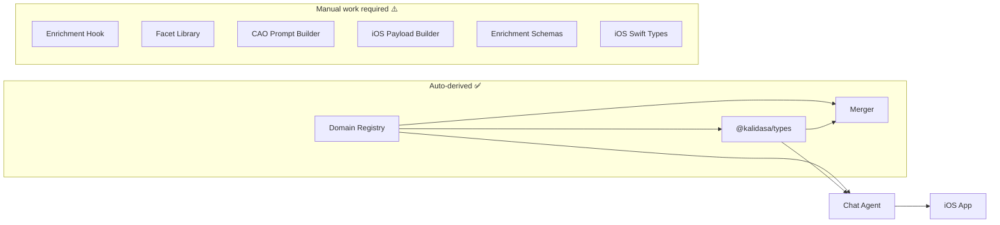

# Adding a New Kalidasa Domain — End-to-End Guide

> This document is the canonical reference for onboarding a new search domain (e.g., `podcasts`). Follow every step. The TypeScript compiler will catch some omissions, but not all.

## Architecture Overview



---

## Phase 1: Registry (auto-propagates)

### Step 1 — Add domain to registry

#### [MODIFY] [registry.ts](file:///Users/matt/Downloads/kalidasa/packages/domain-registry/src/registry.ts)

Add a new entry to `DOMAIN_REGISTRY.domains`:

```typescript
podcasts: {
    name: 'podcasts',
    singularType: 'podcast',
    displayName: 'Podcasts & Shows',
    enrichmentHooks: ['podcast_index'],   // Which API verifies results
    identifierSpec: { host: '...', feedUrl: '...' },
    temporalityDefault: 'evergreen',
    itemRenderer: 'podcast_card',
    exclusionCategories: ['genres', 'topics'],
    detectionKeywords: [
        'podcast', 'episode', 'listen', 'show', 'host',
        'interview', 'series', 'audio',
    ],
},
```

**What auto-propagates from this one edit:**
- `DomainName` union gains `'podcasts'`
- `SingularType` union gains `'podcast'`
- `ItemRendererType` union gains `'podcast_card'`
- `DOMAIN_NAMES` array includes `'podcasts'`
- `Domain` in `@kalidasa/types` includes `'podcasts'`
- `EnrichmentDomain` includes `'podcasts'`
- `RenderHints.itemRenderer` includes `'podcast_card'`
- `IOSDomainSchema` (Zod) accepts `'podcasts'`
- Merger's `getItemRenderer()` returns `'podcast_card'` for `'podcasts'`
- Chat Agent's `resolveSearchResultType()` maps enrichment key `podcasts` → `podcast`
- Chat Agent's `typeToIOSDomain()` maps `podcast` → `'podcasts'`

### Step 2 — Rebuild registry

```bash
cd kalidasa/packages/domain-registry && npm run build
```

Verify: hover over `DomainName` in IDE — must show `'podcasts'` in the union.

### Step 3 — Update exhaustive switch canary

#### [MODIFY] [domain-exhaustiveness.test.ts](file:///Users/matt/.gemini/antigravity/scratch/chat-search-agent/src-v2/services/__tests__/domain-exhaustiveness.test.ts)

Add the new cases to both switch statements:

```typescript
case 'podcast': return 'podcast';   // in assertExhaustiveSearchResultType
case 'podcasts': return 'podcasts'; // in assertExhaustiveIOSDomain
```

> [!NOTE]
> The canary test will **fail to compile** until you add these cases. That's the point — it tells you the registry change propagated.

### Step 4 — Sync registry to Chat Agent

```bash
cp -R kalidasa/packages/domain-registry/src/* \
  chat-search-agent/src-v2/kalidasa-packages/@kalidasa/domain-registry/src/
cp -R kalidasa/packages/domain-registry/dist/* \
  chat-search-agent/src-v2/kalidasa-packages/@kalidasa/domain-registry/dist/
```

---

## Phase 2: Data Pipeline (manual — structural types)

These files have domain-specific structure that can't be auto-derived.

### Step 5 — Enrichment type definition

#### [MODIFY] [cao.ts](file:///Users/matt/Downloads/kalidasa/packages/types/src/cao.ts)

Add the enrichment interface for the new domain's verified data shape:

```typescript
export interface PodcastsEnrichment {
    host?: string;
    episodeCount?: number;
    rating?: number;
    genres?: string[];
    feedUrl?: string;
    imageUrl?: string;
    latestEpisode?: string;
    publisher?: string;
}
```

#### [MODIFY] [enrichment.ts](file:///Users/matt/Downloads/kalidasa/packages/types/src/enrichment.ts)

Add the field to `EnrichmentData`:

```typescript
export interface EnrichmentData {
    // ...existing fields...
    podcasts?: import('./cao.js').PodcastsEnrichment;
}
```

> [!WARNING]
> This step is **not caught by the compiler**. If you forget it, enrichment data for the new domain will be silently ignored.

### Step 6 — Chat Agent enrichment Zod schema

#### [MODIFY] [enrichment.ts](file:///Users/matt/.gemini/antigravity/scratch/chat-search-agent/src-v2/schemas/enrichment.ts)

Add a Zod schema for runtime validation:

```typescript
export const PodcastEnrichmentSchema = z.object({
    host: z.string().optional(),
    episodeCount: z.number().optional(),
    rating: z.number().optional(),
    genres: z.array(z.string()).optional(),
    feedUrl: z.string().optional(),
    imageUrl: z.string().optional(),
    latestEpisode: z.string().optional(),
    publisher: z.string().optional(),
});

export type PodcastEnrichment = z.infer<typeof PodcastEnrichmentSchema>;
```

Add to `EnrichmentDataSchema`:

```typescript
export const EnrichmentDataSchema = z.object({
    // ...existing fields...
    podcasts: PodcastEnrichmentSchema.optional(),
}).passthrough();
```

### Step 7 — Enrichment hook implementation

#### [NEW] `kalidasa/packages/enrichment/src/hooks/podcast-index.ts`

Implement the `EnrichmentHook` interface:

```typescript
import type { EnrichmentHook, EnrichmentContext, EnrichmentData, RawCAOCandidate } from '@kalidasa/types';

export class PodcastIndexHook implements EnrichmentHook {
    name = 'podcast_index';
    domains = ['podcasts'] as const;
    priority = 100;

    async enrich(candidate: RawCAOCandidate, context: EnrichmentContext): Promise<EnrichmentData | null> {
        // Call Podcast Index API, iTunes API, etc.
        // Return { verified: true, source: 'podcast_index', podcasts: { ... } }
    }
}
```

#### [MODIFY] [hooks/index.ts](file:///Users/matt/Downloads/kalidasa/packages/enrichment/src/hooks)

Register the new hook:

```typescript
import { PodcastIndexHook } from './podcast-index.js';
registry.register(new PodcastIndexHook());
```

#### [MODIFY] [index.ts](file:///Users/matt/Downloads/kalidasa/packages/enrichment/src/index.ts)

Export the new hook:

```typescript
export { PodcastIndexHook } from './hooks/podcast-index.js';
```

### Step 8 — CAO prompt builder identifier spec

#### [MODIFY] [prompt-builder.ts](file:///Users/matt/Downloads/kalidasa/packages/cao-generator/src/prompt-builder.ts)

Add the identifier spec for CAO generation:

```typescript
const specs: Record<string, string> = {
    // ...existing entries...
    podcasts: '"identifiers": {"host": "...", "feedUrl": "..."}',
};
```

> [!NOTE]
> The identifier spec tells Gemini what unique fields to return. This should match the `identifierSpec` in the registry entry — consider deriving this from the registry in a future cleanup.

### Step 9 — Facet library (if applicable)

#### [NEW] `kalidasa/packages/facet-libraries/src/podcasts.ts`

If the domain needs facet-based ranking (most do):

```typescript
import type { Facet } from './index.js';

export const podcastFacets: Facet[] = [
    { name: 'genres', weight: 0.3, values: ['true crime', 'comedy', 'news', 'tech', ...] },
    { name: 'format', weight: 0.2, values: ['interview', 'narrative', 'solo', 'panel'] },
    // ...
];
```

Register in the facet library index.

---

## Phase 3: Rendering Pipeline (Chat Agent → iOS)

### Step 10 — iOS payload extractor

#### [MODIFY] [ios-payload-builder.ts](file:///Users/matt/.gemini/antigravity/scratch/chat-search-agent/src-v2/services/ios-payload-builder.ts)

Add extraction function and switch case:

```typescript
// Add to extractDomainData switch:
case 'podcast':
    return extractPodcastData(enrichment);

// New extractor:
function extractPodcastData(enrichment: EnrichmentData): ExtractedData {
    const podcast = enrichment.podcasts;
    if (!podcast) return { photoUrl: null, fields: {} };

    const parts: string[] = [];
    if (podcast.host) parts.push(podcast.host);
    if (podcast.episodeCount) parts.push(`${podcast.episodeCount} episodes`);
    if (podcast.rating) parts.push(`★ ${podcast.rating}`);

    return {
        photoUrl: podcast.imageUrl || null,
        description: podcast.latestEpisode,
        fields: {
            subtitle: parts.join(' · ') || undefined,
        },
    };
}
```

### Step 11 — Chat Agent SearchResult metadata type

#### [MODIFY] [types/index.ts](file:///Users/matt/.gemini/antigravity/scratch/chat-search-agent/src-v2/types/index.ts)

Add the result metadata interface:

```typescript
export interface PodcastResult {
    host?: string;
    episodeCount?: number;
    rating?: number;
    genres?: string[];
    feedUrl?: string;
}
```

Add to the `SearchResult.metadata` union:

```typescript
metadata: PlaceResult | MovieResult | ... | PodcastResult;
```

### Step 12 — iOS Swift types and rendering

#### [MODIFY] `MediaRecommendation.swift`

```swift
// Add MediaType case:
case podcast

// Add detail struct:
struct PodcastDetails {
    let host: String?
    let episodeCount: Int?
    let rating: Double?
}

// Add MediaContent case:
case podcast(PodcastDetails)
```

#### [MODIFY] `SearchResultBatchMessage.swift`

Add Codable fields for podcast-specific data (`host`, `episodeCount`, etc.).

#### [MODIFY] `GetChatMessages.swift`

Add to `RenderHints.Domain`:
```swift
case podcasts
```

Add to `RenderHints.ItemRenderer`:
```swift
case podcastCard = "podcast_card"
```

#### [MODIFY] `ChatScreenViewModel.swift`

Add podcast case to `convertStreamingResultToMediaRecommendation`:
```swift
case .podcasts:
    content = .podcast(PodcastDetails(
        host: result.host,
        episodeCount: result.episodeCount,
        rating: result.rating
    ))
```

#### [MODIFY] `MediaRecommendationCard.swift`

Route `podcastCard` to the appropriate card template.

#### [MODIFY] `MediaRecommendationDetail.swift`

Add `.podcast` case to `collapsedSize` and `contentView` switches.

---

## Phase 4: Build, Deploy, Verify

### Step 13 — Build everything

```bash
# Kalidasa monorepo
cd kalidasa && npx turbo build

# Sync updated packages to Chat Agent
# (copy domain-registry, types if needed)

# Chat Agent
cd chat-search-agent/src-v2 && npx tsc --noEmit
```

### Step 14 — Deploy

```bash
# Deploy both servers (see /deploy-chat-agent workflow)
bash environments/experiment/deploy.sh
bash environments/production-worker/deploy.sh
```

### Step 15 — Verify

```bash
# Experiment server
curl http://54.167.63.80:3002/health

# Production worker
ssh <opts> ubuntu@54.167.63.80 'pm2 logs chat-agent-worker --nostream --lines 20'
# Must show: ✅ Agent Online and Listening

# Test query
curl -X POST http://54.167.63.80:3002/api/chat \
  -H 'Content-Type: application/json' \
  -d '{"message":"best podcasts about AI","senderId":"test","senderName":"Test","conversationId":"test-001"}'
```

### Step 16 — Xcode build

Open the iOS project in Xcode and do a clean build (`Cmd+Shift+K` → `Cmd+B`).  
Fix any exhaustive switch errors the compiler flags — these indicate Swift files that need the new domain case.

---

## Quick Reference: What's Auto vs Manual

| Touchpoint | Auto-derived? | Compiler catches? |
|---|---|---|
| `DomainName` type union | ✅ Yes | N/A |
| `SingularType` type union | ✅ Yes | N/A |
| `ItemRendererType` type union | ✅ Yes | N/A |
| `Domain` (`@kalidasa/types`) | ✅ Yes | N/A |
| `EnrichmentDomain` | ✅ Yes | N/A |
| `IOSDomainSchema` (Zod) | ✅ Yes | N/A |
| Merger `getItemRenderer()` | ✅ Yes | N/A |
| Type resolver mappings | ✅ Yes | N/A |
| Canary switch test | — | ✅ **Fails to compile** |
| Enrichment interface (`cao.ts`) | ❌ Manual | ❌ No |
| `EnrichmentData` field | ❌ Manual | ❌ No |
| Enrichment Zod schema | ❌ Manual | ❌ No |
| Enrichment hook | ❌ Manual | ❌ No |
| CAO prompt identifierSpec | ❌ Manual | ❌ No |
| Facet library | ❌ Manual | ❌ No |
| `extractDomainData` switch | ❌ Manual | ⚠️ Only if `default` removed |
| `SearchResult.metadata` union | ❌ Manual | ❌ No |
| iOS Swift types/cards | ❌ Manual | ✅ Xcode exhaustive switch |

---

## Checklist Template

Copy this for each new domain:

```markdown
## Domain: ___________

### Registry (auto-propagates)
- [ ] registry.ts — add domain entry with singularType, itemRenderer, keywords
- [ ] Rebuild domain-registry
- [ ] domain-exhaustiveness.test.ts — add new cases
- [ ] Sync to Chat Agent bundle

### Data Pipeline (manual)
- [ ] cao.ts — add XxxEnrichment interface
- [ ] enrichment.ts (@kalidasa/types) — add field to EnrichmentData
- [ ] enrichment.ts (Chat Agent) — add Zod schema + add to EnrichmentDataSchema
- [ ] New enrichment hook — implement EnrichmentHook
- [ ] hooks/index.ts — register hook
- [ ] enrichment/index.ts — export hook
- [ ] prompt-builder.ts — add identifierSpec

### Rendering Pipeline (manual)
- [ ] ios-payload-builder.ts — add extractXxxData + switch case
- [ ] types/index.ts — add XxxResult interface + metadata union
- [ ] iOS Swift: MediaRecommendation.swift (type + details + content)
- [ ] iOS Swift: SearchResultBatchMessage.swift (Codable fields)
- [ ] iOS Swift: GetChatMessages.swift (Domain + ItemRenderer)
- [ ] iOS Swift: ChatScreenViewModel.swift (conversion logic)
- [ ] iOS Swift: MediaRecommendationCard.swift (card routing)
- [ ] iOS Swift: MediaRecommendationDetail.swift (detail view)

### Deploy & Verify
- [ ] turbo build (Kalidasa)
- [ ] tsc --noEmit (Chat Agent)
- [ ] Deploy experiment + production
- [ ] Xcode clean build
- [ ] Test query verification
```
